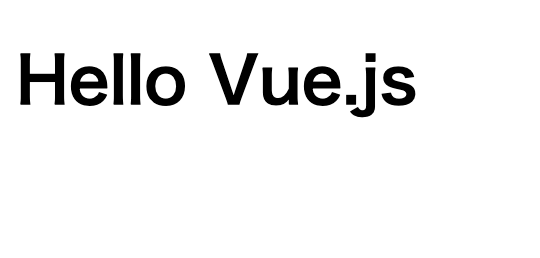

# cdn-vue

CDNを使用したVue.jsのサンプル

## 環境構築

以下のフォルダ・ファイルを準備

```bash
project
├── css
│   └── style.css
├── index.html
└── js
```

`index.html`でVue.jsが使用できるようにCDNから読み込む

バージョン指定をしない場合、npm上の最新が取得される。  
今回はバージョンを指定して使用する。

以下のフォーマットでファイル・バージョン指定を行う  
`https://cdn.jsdelivr.net/npm/<package>@<version>/<file>`

```html
<!DOCTYPE html>
<html lang="ja">
<head>
  <meta charset="UTF-8">
  <meta name="viewport" content="width=device-width, initial-scale=1.0">
  <meta http-equiv="X-UA-Compatible" content="ie=edge">
  <script src="https://cdn.jsdelivr.net/npm/vue@2.6.10/dist/vue.js"></script>
  <title>CDN Vue</title>
</head>
<body>
  <div class="container">
    <div id="app">
      <h1>{{ msg }}</h1>
    </div>
  </div>
  <script>
    new Vue({
      el: '#app',
      data: {
        msg: 'Hello Vue.js'
      }
    })
  </script>
</body>
</html>
```

`index.html`をブラウザで表示する



たったこれだけ。

## Vue Routerを使用する

作成時点の最新をCDNから読み込み (2019/07/19現在)

```html
<script src="https://unpkg.com/vue-router@3.0.7/dist/vue-router.js"></script>
```
